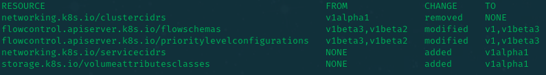

# KubeGlass 🔮

## Overview
Make kubernetes API changes between versions as transparent as glass.

**NOTE:** This program only works with kubernetes versions 1.28+.

## Description
KubeGlass allows to compare 2 kubernetes versions and see what changed on the different APIs between them.

## Installation
Run `go install github.com/clebs/kubeglass`.

## Usage
To compare 2 kubernetes versions run `kubeglass --from=1.28 --to=1.29`. This will show the following output:

## Roadmap
- [ ] Persistent caching of downloaded data
- [ ] Airgapped support
    - Allow `-f/--from` and `-t/--to` flags to take input files.
- [ ] Richtext and colored printing to stdout
- [ ] Krew support
- [ ] Scan running clusters via the `/apis` endpoint
